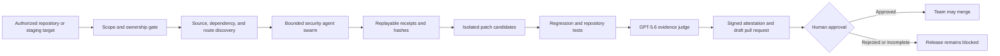

# SentinelForge

**An autonomous, proof-carrying security release gate for application programming interfaces.**

[Live demo](https://sentinelforge.fly.dev/) · [Architecture](docs/ARCHITECTURE.md) · [OpenAI Build Week notes](docs/OPENAI_BUILD_WEEK.md) · [Three-minute demo script](docs/YOUTUBE_SCRIPT.md)

SentinelForge is an **OpenAI Build Week 2026** submission for the **Developer Tools** track. It helps teams review the growing volume of machine-generated code before release. Instead of stopping at a scanner alert, SentinelForge maps an authorized target, runs bounded security agents, records replayable evidence, proposes an isolated patch, tests it, asks GPT-5.6 to independently review the redacted evidence, and keeps merge and deployment behind a human gate.

## Why this exists

Development teams can now create code faster than security teams can manually review it. Existing scanners often produce a queue of findings that engineers must reproduce, prioritize, patch, test, and document by hand.

SentinelForge turns that ticket queue into one reviewable artifact:

1. What security invariant failed?
2. Can the failure be reproduced within the authorized scope?
3. What minimal patch addresses it?
4. Do the security regression and repository tests pass?
5. Does an independent GPT-5.6 judge agree that the evidence is complete enough for human review?
6. What remains blocked before a person approves the release?

The product is not an autonomous merge bot. A model can recommend, but deterministic tests and human approval control the release.

## OpenAI Build Week contribution

### How Codex was used

Codex was the primary implementation partner for the project. It converted the product brief into the Python control plane, threat-intelligence adapters, scoped agent workflow, isolated remediation path, browser interface, test suite, deployment configuration, and submission documentation. Codex was also used to inspect the live Fly.io deployment, reproduce the schedule routing defect, add regression coverage, and review the final change set.

All repository commits were created during the Build Week submission period. The first commit is `3e0591c` on July 17, 2026. The OpenAI-specific extension was developed with Codex and includes the GPT-5.6 evidence judge, interface changes, compliance documentation, and additional tests. See [the build log](docs/CODEX_BUILD_LOG.md) for dated evidence and the required Codex session placeholder.

### What GPT-5.6 does

GPT-5.6 is an **independent evidence judge**, not the vulnerability detector and not the release authority. The deterministic engine decides whether an exploit or test passed. GPT-5.6 receives only a bounded, redacted summary containing finding counts, receipt identifiers, evidence hashes, policy denials, test results, and the existing deterministic verdict.

The reviewer uses the OpenAI Responses application programming interface with strict structured output. It returns one of:

- `approve_for_human_review`
- `block`
- `needs_more_evidence`

The adapter enforces an important invariant in code: GPT-5.6 cannot turn a deterministic `BLOCKED` result into an approval. It cannot execute tools, edit files, open or merge a pull request, or deploy. Its output is advisory and becomes part of the signed evidence bundle.

GPT-5.6 is a good fit for this narrow role because evidence review requires cross-document reasoning and contradiction detection, while deterministic security checks remain the source of truth.

## End-to-end architecture



### Core flow

1. **Authorize**: Load a scope policy and prove ownership before any live target testing.
2. **Discover**: Parse FastAPI, Django, and OpenAPI routes; build a software bill of materials; load public vulnerability intelligence.
3. **Attack safely**: Run rate-limited authorization, injection, dependency, and hypothesis-driven test agents. A kill switch and deny-by-default policy constrain actions.
4. **Prove**: Store redacted requests, responses, expected invariants, observed behavior, replay commands, and SHA-256 evidence hashes.
5. **Patch in isolation**: Create competing minimal patches in disposable workspaces. Never modify the source repository in place.
6. **Verify**: Run a permanent regression test and the repository test suite. Failed verification rejects the patch.
7. **Judge evidence**: GPT-5.6 reviews only the redacted evidence summary and returns a strict advisory decision.
8. **Gate**: Produce an attestation and optional draft pull request. No agent can merge or deploy.

## What is intelligent versus deterministic

| Responsibility | Mechanism | Authority |
|---|---|---|
| FastAPI and Django authorization detection | Static analysis | Can block candidate |
| Dependency matching and reachability | Package parsing, vulnerability feeds, call-graph evidence | Can block candidate |
| Exploit hypothesis and payload prioritization | Specialized model-assisted agents plus prior-run memory | Must be validated before blocking |
| Patch proposal | Deterministic patcher plus configured model providers | Cannot merge |
| Patch verification | Regression tests, repository tests, replay checks | Can reject patch |
| Evidence completeness review | GPT-5.6 structured decision | Advisory only |
| Merge or deployment | Human reviewer and repository protection | Final authority |

## Safety boundaries

- Test only repositories and targets you own or have explicit permission to assess.
- Live network testing requires ownership proof and a scope file.
- Production targets are blocked by default.
- Requests are rate limited and capped per run.
- `.sentinelforge/STOP` is the local kill switch.
- OpenShell policies deny destructive commands, private-network access, privilege escalation, denial-of-service patterns, and out-of-scope writes.
- Repository content is untrusted data. It is redacted and bounded before entering a model context.
- Tokens and secrets are never returned by the integration-status endpoint.
- Pull requests are drafts. `no_agent_can_merge_pr: true` is a system invariant.
- Public model-triggering endpoints have per-client and global hourly quotas. Remote schedule administration is disabled unless `SENTINELFORGE_ADMIN_TOKEN` is configured and supplied in the `X-SentinelForge-Admin` header.

Read [docs/SECURITY.md](docs/SECURITY.md) before using a live target.

## Try it without rebuilding

Judges can use the deployed interface at **https://sentinelforge.fly.dev/**.

Recommended test path:

1. Open **Scan**.
2. Scan the bundled `examples/vulnerable_shop` repository in a local installation, or inspect the deployed interface and prior run evidence.
3. Open **Release Proof** and start a proof run against `examples/vulnerable_shop`.
4. Inspect the deterministic finding, isolated patch receipt, and verification output.
5. Open **Pentest** in `quick` mode for a source-only run. This makes no live attack requests.
6. Inspect the final report, human gate, signed attestation, and GPT-5.6 evidence decision.

The deployed environment may show `AWAITING KEY` for optional providers. This is an explicit degraded state, not a fabricated success. Detection and deterministic verification continue without sponsor or model availability.

## Local quick start

### Supported platforms

- macOS 13 or newer
- Linux distributions capable of running Python 3.12 or newer
- Docker on macOS or Linux
- The browser interface supports current Chrome, Firefox, Safari, and Edge

Windows is supported through Windows Subsystem for Linux or Docker; native Windows process behavior has not been validated.

### Install

```bash
git clone https://github.com/gedyeyasu/SentinelForge.git
cd SentinelForge
python3 -m venv .venv
.venv/bin/pip install -e '.[dev]'
cp .env.example .env
```

The deterministic demo does not require external model keys.

### Run the deterministic proof loop

```bash
.venv/bin/sentinelforge scan examples/vulnerable_shop
.venv/bin/sentinelforge remediate examples/vulnerable_shop
.venv/bin/python -m pytest -q
```

### Run the web application

```bash
.venv/bin/sentinelforge-api
# Open http://127.0.0.1:8741
```

### Run a source-only pentest

```bash
.venv/bin/sentinelforge pentest examples/vulnerable_shop \
  --scope config/scope.yaml \
  --mode quick \
  --source-only
```

Do not point SentinelForge at a live system without authorization, ownership verification, and a narrow scope policy.

## Configuration

Only `OPENAI_API_KEY` is required for the GPT-5.6 evidence-review stage.

```dotenv
OPENAI_API_KEY=
OPENAI_BASE_URL=https://api.openai.com/v1
OPENAI_MODEL=gpt-5.6
OPENAI_REASONING_EFFORT=medium
```

Optional integrations are documented in [.env.example](.env.example):

- GitHub token or OAuth credentials for repository listing and draft pull requests
- NVIDIA NIM for secondary threat analysis and patch candidates
- vLLM for a self-hosted model path
- HiddenLayer for model-interaction runtime inspection
- Supabase for optional cloud persistence

Red Hat security data is public and does not require a key.

## Main application programming interface endpoints

| Method | Path | Purpose |
|---|---|---|
| `GET` | `/health` | Service health |
| `GET` | `/api/integrations` | Provider readiness without exposing secrets |
| `POST` | `/api/runs` | Start deterministic detection and remediation |
| `GET` | `/api/runs/{id}` | Read proof-run status and result |
| `POST` | `/api/scan` | Scan an authorized local repository |
| `POST` | `/api/scan/github` | Clone and scan an authorized GitHub repository |
| `POST` | `/api/pentest` | Start a scoped agent run |
| `GET` | `/api/pentest/{id}` | Read run events and evidence |
| `GET` | `/api/pentest/{id}/stream` | Stream agent events |
| `POST` | `/api/pentest/{id}/patch-pr` | Propose, verify, and optionally open a draft pull request |
| `GET` | `/api/pentest/schedule` | List recurring security gates |

## Test and quality checks

```bash
.venv/bin/python -m pytest -q
.venv/bin/ruff check src tests
```

The test suite covers scope enforcement, policy denials, route discovery, dependency intelligence, evidence redaction, patch isolation, verification, attestation, GitHub flows, scheduling, the GPT-5.6 request boundary, strict output parsing, and the rule that a model cannot override a deterministic block.

## Example and synthetic data provenance

- `examples/vulnerable_shop` is a synthetic FastAPI application created for this project. It intentionally contains a broken object-level authorization defect and is safe to run locally.
- `fixtures/demo_evidence` contains synthetic fallback evidence generated from the bundled application. It is labeled fixture data and must not be presented as a live run.
- Red Hat security advisories come from Red Hat's public Security Data application programming interfaces.
- National Vulnerability Database, Known Exploited Vulnerabilities, Exploit Prediction Scoring System, Open Source Vulnerabilities, and GitHub Security Advisory data retain their upstream identifiers and timestamps.
- No proprietary Oracle source code or data is included in this repository.

## Known limitations

- Static source detectors currently focus on Python FastAPI and Django patterns. Live OpenAPI testing is language independent.
- “Zero-day hunting” means hypothesis-driven discovery of previously unknown-to-this-system defects. It does not guarantee discovery of real zero-day vulnerabilities.
- The source-only pentest cannot prove a remote exploit succeeded.
- Model-assisted patches can be wrong. Only test-passing candidates are shown, and a human must review them.
- The current attestation signer is intended for demonstration. Production use should replace the local key with a managed signing service.
- Provider availability, quotas, and cyber-safety checks may cause GPT-5.6 or another model stage to fail or pause. Deterministic verdicts remain available.
- In-flight pentest workers are process-local. A deployment restart can interrupt an active run; production use needs a durable external job queue and recovery worker.
- This is a hackathon prototype, not a substitute for a professional penetration test or a complete secure-development program.

## Repository map

```text
src/sentinelforge/
  agents/              bounded discovery and security workers
  control/             FastAPI control plane and SQLite persistence
  inference/           NVIDIA, vLLM, and GPT-5.6 adapters
  integrations/        GitHub, Red Hat, HiddenLayer, OpenShell, Supabase
  intelligence/        vulnerability ingestion and prior-run learning
  remediation/         deterministic isolated patch creation
  web/static/          browser interface
  pentest.py           end-to-end pentest phase handlers
  orchestrator.py      ordered, time-bounded phase execution
tests/                 automated test suite
examples/              synthetic vulnerable application
config/                scope and policy examples
docs/                  architecture, safety, deployment, and demo material
```

## Submission checklist

- [x] Working project
- [x] Developer Tools track
- [x] Public repository and explicit evaluation license
- [x] Installation instructions and supported platforms
- [x] Deployed test instance
- [x] Sample data and provenance
- [x] Codex and GPT-5.6 implementation explanation
- [x] Known limitations
- [ ] Public YouTube demo shorter than three minutes
- [ ] Paste the `/feedback` Codex Session ID into Devpost and `docs/CODEX_BUILD_LOG.md`

## License

Copyright 2026 Gedeon Tona. The repository includes a limited evaluation license for OpenAI Build Week judges. See [LICENSE](LICENSE). Third-party dependencies and data remain under their respective licenses.
