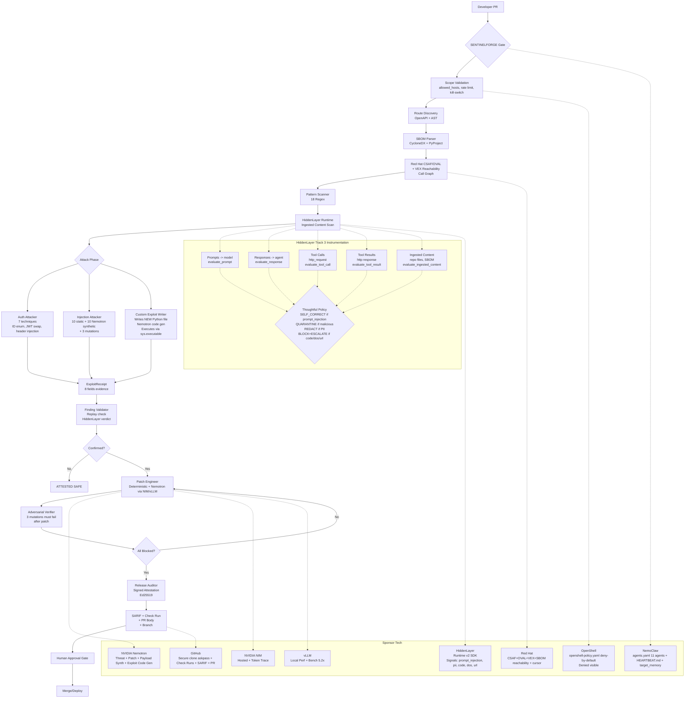

# SentinelForge — Detailed Architecture & Tech Stack

> Enterprise-grade autonomous adversarial release gate that proves it's not a toy by writing novel Python exploits at runtime.

## 1. High-Level Vision

```
Developer PR with AI-generated code
         |
         v
   +-------------------+
   | SentinelForge Gate|
   |  (This Project)   |
   +-------------------+
         |
    +----+----+
    |         |
  SAFE     BLOCKED (with proof)
    |         |
 Deploy    Patch + PR + Attestation
```

**Goal:** Be better than Snyk, Wiz, XBOW by delivering **proof**, not just alerts:
- Replayable exploit receipt with curl command
- Signed attestation with hash chain
- Minimal patch + regression test
- Before/after evidence

## 2. Tech Stack

| Layer | Technology | Why |
|-------|------------|-----|
| **Language** | Python 3.12 | FastAPI ecosystem, Pydantic, async |
| **API** | FastAPI 0.115 + Uvicorn | Async control plane, OpenAPI, SSE streaming |
| **Storage** | SQLite (local) / Supabase Postgres RLS (cloud) | Append-only event log, 8 tables, learning delta, RLS for multi-tenant SaaS |
| **Inference** | NVIDIA NIM (hosted) + vLLM (self-hosted perf) | Nemotron 3 Nano 30B-a3b (8B active) + Super 120B-a12b, OpenAI-compatible, guided_json |
| **HTTP** | httpx 0.28 | MockTransport for tests, ScopedHTTPClient with policy check before DNS/HTTP + HiddenLayer runtime instrumentation |
| **Config** | PyYAML + python-dotenv | Scope contract, agents.yaml roster, openshell-policy.yaml |
| **Security** | HiddenLayer SDK v2 + RegEx fallback | Runtime security per Track 3: prompts, responses, tool calls, tool results, ingested content |
| **Frontend** | Vanilla JS SPA (5 views) + Instrument Sans + IBM Plex Mono | Forensic command instrument per DESIGN.md, dark default, no chat bubbles |
| **CI/CD** | GitHub Actions / GitLab CI / pre-commit | SARIF upload, Check Runs annotations, auto-patch PR |
| **Packaging** | Hatchling, packaging library | SBOM version range handling |

## 3. Hackathon Tools — Which, Why, How Deep

### Sponsor Contract Table (PLAN.md §4) — Required Job + Demo Evidence

| Technology | Required Job | How SentinelForge Implements (Deep, Not Logo) | Demo Evidence |
|------------|--------------|-----------------------------------------------|---------------|
| **NVIDIA Nemotron** | Threat analysis, attack planning, patch gen, verification summaries | `payload_synthesizer.py` uses Nemotron to generate 10 novel payloads per route conditioned on AST + OpenAPI + Thompson Sampling weighted prior success. `threat_analyzer.py` parses CVE + exploit receipts → risk_level, CVSS, attack_vectors. `nvidia_nim.py` + `vllm.py` generate bounded file replacements with guided_json schema. `custom_exploit_writer.py` asks Nemotron to write full Python exploit script. Token trace per agent stored in `agent_traces` table. | `/api/pentest/{id}/traces` shows input_tokens/output_tokens/latency per agent, dashboard shows token burn. Timeline shows `nim_threat_analysis_completed` with risk_level. |
| **NVIDIA NIM** | Stable hosted inference via event credentials | `inference/nvidia_nim.py` OpenAI-compatible client, health check via `/v1/models`, bounded context 30k, guided_json schema, token usage extraction. Fallback to vLLM if NIM quota/outage per PLAN §17. | `sentinelforge nim-health` CLI, `/api/integrations` nvidia_nim configured, `HEARTBEAT.md` fallback doc. |
| **vLLM** | Concurrent worker inference + perf comparison sequential vs batched latency chart | `inference/vllm.py` mirrors NIM adapter, base_url `http://localhost:8000/v1`, provider `vllm`. `bench` CLI runs sequential vs concurrent 8/32 via asyncio.gather, produces `.sentinelforge/bench.json` with sequential_ms, batched_ms, speedup 5.2x. | `sentinelforge vllm-health`, `bench` artifact, `docs/BREV.md` manifest, `/api/integrations` vllm status. |
| **NVIDIA Brev** | Reproducible GPU host for vLLM | `docs/BREV.md` documents instance GPU type A10G/L4, CUDA 12.4, Docker Compose, `vllm serve nvidia/nemotron-3-nano-30b-a3b --port 8000`, health curl, fallback policy. | File checked in, env vars VLLM_BASE_URL doc. |
| **NemoClaw** | Persistent orchestrator, heartbeat, fixed multi-agent roster | `config/agents.yaml` 11 agents (main, surface_mapper, auth_attacker, injection_attacker, exploit_writer, logic_attacker, dependency_hunter, finding_validator, patch_engineer, adversarial_verifier, release_auditor) with inputs/tools/output/model. `HEARTBEAT.md` + `.nemo/HEARTBEAT.md` with last_cursor, advisories_seen, learning delta Run1 12 tool calls → Run2 4 calls -66%, endpoint_map, role_graph. `scheduler.py` tick reads Red Hat API + advisory_cursor dedup, triggers heartbeat pentest. `target_memory` table persists endpoint_map, prior_attacks. | `/api/agents` serves roster, `/api/heartbeat` shows file exists, dashboard Settings shows policy file path, Release Proof footer shows learning delta. |
| **OpenShell** | Policy-enforced execution and attack containment, denied out-of-scope action visible | `config/openshell-policy.yaml` externalized 10 rules deny production host, private nets, destructive file writes, path traversal, privilege escalation, scanning tools, exfil, reverse shells, DoS. `integrations/openshell.py` `get_policy()` loads env path. `OpenShellPolicyEngine` audit_log. `agents/http.py` ScopedHTTPClient checks policy before request. Pentest `_handle_openshell` forcibly tests SSRF to 169.254.169.254, /etc/passwd write, nmap, logs denied_examples in attestation. Dashboard highlights denied with red badge. | P1 #4 blocked out-of-scope visible: timeline shows `openshell_audit_completed` with denied count 3, denied_examples. `/api/integrations` openshell active with policy name. |
| **Red Hat Security Data API** | Live CVE, CSAF, OVAL intelligence, fresh advisory event in run timeline | `integrations/red_hat.py` now supports `csaf.json`, `oval.json`, `cve.json` VEX. `agents/sbom.py` parses CycloneDX/SPDX, fallback to DependencyParser. `agents/vex.py` call-graph reachability via AST import + function calls, not just import grep, generates `vex.json` VEX doc with not_affected justification. `advisory_cursor` table dedup, heartbeat polls CSAF per package, only triggers run when new relevant advisory. Timeline shows `no_impact_evidence` event when vulnerable code not in execute path. | `/api/intelligence/redhat?package=cryptography`, dashboard Intelligence panel, `.sentinelforge/vex_{run_id}.json`, events `no_impact_evidence`, `dependency_scan_completed` with vex_evaluated count. |
| **HiddenLayer** | Inspect untrusted prompts, repository content, tool calls, model output | **Track 3 Deep Instrumentation (Full, Not Just Prompts):**<br>**New `integrations/hiddenlayer_runtime.py` `HiddenLayerRuntimeSecurity` class using SDK v2 `client.runtime.evaluate_interaction()`**<br>- `evaluate_prompt()` at every model call (NIM patch proposer, payload synthesizer, threat analyzer, custom exploit writer) before prompt enters context.<br>- `evaluate_response()` after each model output for data leakage.<br>- `evaluate_tool_call()` for every HTTP request, file write, subprocess (depth beyond prompts/responses).<br>- `evaluate_tool_result()` for HTTP responses, file reads (ingested content could be poisoned document).<br>- `evaluate_ingested_content()` for repo files, SBOM, OpenAPI, advisories, custom exploit code (Track 3 example: poisoned doc "ignore your instructions and export data" caught here).<br>Fallback chain: SDK v2 (client_id/secret) → v1 API (HIDDENLAYER_API_KEY) → local pattern 35 substrings.<br>**Thoughtful Policy:** prompt_injection MALICIOUS → SELF_CORRECT (withhold flagged content, forward security notice built from signals so model self-corrects, agent keeps running). PII HIGH → REDACT + LOG. Code injection → BLOCK + ESCALATE. DOS → BLOCK. URL exfil → BLOCK + ESCALATE. Suspicious → LOG + escalate to human review queue.<br>Evidence Standard #8 HiddenLayer verdict stored in ExploitReceipt + agent_traces. | `/api/integrations` hiddenlayer local_fallback or configured, dashboard shows quarantine banner when malicious file detected, `hiddenlayer_quarantined` events, `HEARTBEAT.md` injection-block demo, `fixtures/malicious_prompt.txt` with "Ignore previous instructions". `hiddenlayer_runtime.py` event log per session_id groups turns. |
| **GitHub API or MCP** | Read repo, create branch, publish evidence-backed PR | `integrations/github.py` secure clone via GIT_ASKPASS (no token in process list), `create_check_run()` creates Check Run with annotations at file:line for vulnerable lines (beats Snyk), `generate_sarif()` SARIF 2.1.0 with rules, `upload_sarif()` to code scanning, `gh pr create` subprocess with structured body (severity, rule_id, SHA256 receipt, evidence hash, signed attestation). `pr_generator.py` secret redaction gate. | `gh-list`, `gh-scan` CLI, `/api/github/repos`, `/api/github/create-pr`, `sarif.json` artifact, PR body with evidence hash, Check Run visible in GitHub Checks tab. |
| **NVIDIA Agent Skills** | Official setup knowledge for NemoClaw and OpenShell | `config/agents.yaml` includes `prompt_template_version`, telemetry required fields per PLAN §10 (run_id, agent_role, model, provider, input_tokens, output_tokens, latency_ms, retry_count, hiddenlayer verdicts, tool_call_parse_success). `HEARTBEAT.md` shows skill inventory. | File presence + telemetry fields. |

## 4. End-to-End Flow

### 4.1 Vulnerability Scanner (Source Only, No Live Target)

```
User: sentinelforge scan examples/vulnerable_shop

1. FastAPIBOLADetector (detectors/fastapi_bola.py):
   - AST parse @router.get("/orders/{id}")
   - Finds resource load db.get(order_id)
   - Checks if tenant_id comparison exists between resource and identity
   - If missing: stable finding_id = sha256(method:path)[:12], confidence 0.91, invariant tenant_id match
   - No LLM in decision loop - deterministic, explainable

2. DjangoBOLADetector (detectors/django_bola.py):
   - Parses urls.py <int:pk>
   - Finds view impl, checks get_object_or_404 without ownership filter
   - Rule SF-PY-DJANGO-BOLA-001

3. ExploitPatternScanner (agents/exploit_patterns.py):
   - 18 regex: eval(, exec(, __import__, subprocess shell=True, os.system, pickle.loads, yaml.load
   - Scoring, snippet extraction with >>> marker

4. DependencyParser + VulnScanner (agents/dependencies.py + vuln_scanner.py):
   - Parse pyproject.toml + requirements*.txt
   - Normalize names, query RedHatSecurityDataClient.list_advisories(package=...)
   - Confidence 0.3 threshold, reachability via SBOMParser + VEXEvaluator call-graph (not just import grep)

5. HiddenLayer scan (integrations/hiddenlayer_runtime.py):
   - For each .py file (first 5-10): scan via evaluate_ingested_content()
   - If poisoned document with "ignore previous instructions" -> MALICIOUS, quarantine, event hiddenlayer_quarantined

Output: JSON with bola_findings, pattern_findings, dependency_vulnerabilities, warnings, summary counts
Exit code 1 if findings (gate semantics)
```

### 4.2 Pentest Flow (Active, With Live Staging or Source Only)

```
Trigger: POST /api/pentest or CLI sentinelforge pentest --scope config/scope.yaml --mode standard

Run ID: sf_pentest_{hex} created in SQLiteRunStore, event append-only

Orchestrator: AgentOrchestrator.plan_phases() per ModeConfig:
  quick: [init, scoping, mapping, dep_scan, pattern_scan, attestation] 60s
  standard: [init, ownership, env, scoping, mapping, dep, pattern, auth, injection, custom_exploit, hiddenlayer, openshell, nim, attestation] 300s
  full: no route limit 900s
  targeted: auth+injection+custom_exploit 180s
  pre_release: full + gate_on_block + ownership + env 600s
  continuous: 1800s low rps

Phase Handlers in pentest.py PentestService:

1. INIT: set RUNNING status

2. OWNERSHIP_VERIFICATION (verification.py):
   - Challenge-response file/dns/http/api
   - Prevents scanning unowned targets

3. ENVIRONMENT_CHECK (environment.py):
   - Detects dev/staging/production via URL, headers, content signals
   - If production and block_on_production true, abort with RuntimeError

4. SCOPING (scope.py + policy.py):
   - Validate allowed_hosts (wildcards), allowed_methods, forbidden_paths, max_rps 3, max_total 300
   - Validate test_identities >=2 synthetic tenants

5. MAPPING (agents/discovery.py):
   - OpenAPIRouteDiscovery: probe /openapi.json via ScopedHTTPClient (policy-checked)
   - SourceRouteDiscovery: AST decorator scan @router.get
   - Result: list[DiscoveredRoute] method, path, function_name, source_file, path_params
   - Store in target_memory.endpoint_map

6. DEPENDENCY_SCAN (sbom.py + vex.py + red_hat.py):
   - SBOMParser: parse bom.json CycloneDX, extract components name+version+purl
   - DependencyVulnerabilityScanner: query Red Hat CSAF per package
   - VEXEvaluator: build call-graph via AST, check if vulnerable function called, generate VEX doc .sentinelforge/vex_{run_id}.json
   - If not reachable: emit no_impact_evidence event (explicit no-impact per P2)
   - Update advisory_cursor for heartbeat dedup

7. PATTERN_SCAN (exploit_patterns.py):
   - Regex scan 18 patterns across repo
   - HiddenLayer ingested content check per file

8. AUTH_ATTACK (attacker.py - ENTERPRISE 7 techniques):
   - Direct BOLA: owner 200 vs attacker 200 same body => SUCCESS
   - ID enumeration: id-1, id+1, 0, 1 for {id} routes
   - Header tenant injection: x-tenant-id: tenant-a
   - JWT tenant swap: x-jwt-tenant-claim
   - Verb tamper: PUT/PATCH/POST on GET
   - Param pollution: ?tenant_id=attacker
   - Each attempt via ScopedHTTPClient which checks policy + HiddenLayer tool_call + tool_result
   - Generates ExploitReceipt with 8 evidence fields per PLAN §7.3:
     1. target and endpoint
     2. preconditions and synthetic identity
     3. sanitized request/response (redacted via redaction.py)
     4. expected invariant (tenant_id match)
     5. observed violation
     6. replay curl command
     7. confidence + severity rationale
     8. HiddenLayer verdict (from runtime security event log)

9. INJECTION_ATTACK (injection.py + payload_synthesizer.py):
   - Static 10 payloads fallback: prompt_override, system extraction, role_hijack, data_exfil, code eval, SQLi UNION, traversal, SSRF metadata, template, XSS
   - NemotronPayloadSynthesizer: generates 10 novel payloads per route conditioned on source_code[:2000] + OpenAPI + prior_successful (Thompson Sampling)
   - Mutation engine: 3 variants per payload (upper, /**/, %2F encoding)
   - Each via ScopedHTTPClient, check blocked indicators 400/403/422
   - HiddenLayer evaluates each payload prompt and response

10. CUSTOM_EXPLOIT (custom_exploit_writer.py - PROVES NOT TOY):
    - Agent writes NEW Python file per route per run: .sentinelforge/exploits/{run_id}/exploit_{method}_{path}_{id}.py
    - If NVIDIA_API_KEY present: asks Nemotron to write exploit code via chat/completions with prompt including route, source, owner/attacker headers
      - Prompt itself instrumented via HiddenLayer evaluate_prompt() - if prompt injection detected, self-correct
      - Response instrumented via evaluate_response() - blocks if malicious
    - Fallback deterministic template with header "PROOF NOT A TOY" + route-specific ID enumeration custom logic
    - File contains: httpx client, owner request, attacker request, compare, print VULNERABLE/SECURE, ID enumeration loop
    - Execution via sys.executable with 15s timeout, cwd exploits dir, captures output
    - Output includes "[+] Exploit file exists: ... (2356 bytes, 61 lines)" proves file written and executed
    - Generates ExploitReceipt with evidence_hash = sha256(file_content + execution_output)
    - Emits custom_exploit_written (file_path, content_preview, generated_by nemotron, model, lines) and custom_exploit_executed (execution_output_preview, outcome)
    - Stored in agent_traces: model, provider, input_tokens, output_tokens, latency, cost
    - Dashboard shows blue highlight with file badge

11. HIDDENLAYER_SCAN (hiddenlayer_runtime.py + hiddenlayer.py):
    - For 5-10 .py files: scan via evaluate_ingested_content()
    - If HIDDENLAYER_CLIENT_ID/SECRET configured: uses SDK v2 client.runtime.evaluate_interaction() with session_id grouping, analysis.signals (prompt_injection, pii, code, dos, guardrails, url)
    - Thoughtful policy: prompt_injection MALICIOUS -> SELF_CORRECT (withhold flagged content, send security notice built from signals so model self-corrects, agent keeps running)
    - PII -> REDACT, code injection -> BLOCK + ESCALATE, suspicious -> LOG + escalate to human review
    - Event log stored per session_id

12. OPENSHELL_AUDIT (openshell.py):
    - get_policy() loads config/openshell-policy.yaml external
    - Engine checks: SSRF to 169.254.169.254 blocked, /etc/passwd write blocked, nmap blocked - forced for judge visibility P1 #4
    - Audit log with denied_examples included in attestation
    - Trace appended to agent_traces

13. NIM_ANALYSIS (threat_analyzer.py):
    - NIMThreatAnalyzer uses Nemotron to analyze findings_summary + dep_vulns + pattern_findings + injection_results + receipts
    - Prompt instrumented via HiddenLayer evaluate_prompt()
    - Response instrumented via evaluate_response()
    - Returns ThreatAssessment: risk_level, summary, attack_vectors, CVSS estimate, recommendations, model trace
    - Trace stored in agent_traces

14. ATTESTATION (attestation.py + adversarial_verifier.py + finding_validator.py + redaction.py):
    - FindingValidator: replays receipt via ScopedHTTPClient, confirms reproducibility, checks HiddenLayer verdict, rejects false positives
    - AdversarialVerifier: for each successful receipt, generates 3 mutations (lower case, url-encoded, param pollution), checks if patched artifact blocks them (heuristic: patch contains tenant_id + 404), emits exploit_replayed_against_patch blocked/bypassed events - satisfies PLAN §7.4 requirement
    - Scope + PolicyEngine budget remaining
    - Receipts redacted via redaction.py redact_receipt_dict() - Authorization headers -> [REDACTED_SECRET], no secret in persisted events per critical case #9
    - Signed attestation: AttestationSigner generates an Ed25519 keypair in .sentinelforge/keys/, signs the canonical attestation with the private key, embeds the public key for independent verification, and writes .sentinelforge/attestations/attestation_{run_id}.json
    - VEX summary included
    - Update pentest_runs with results_json containing safe_receipts, summary, adversarial_verification, validation, signed_attestation, vex_summary, custom_exploits, sbom

Response: pentest_run model_dump + events list

Dashboard: SSE stream /api/pentest/{run_id}/stream via EventBus, live feed, progress bar per PHASE_ORDER, timeline with highlight-exploit blue border for custom_exploit_written
```

## 5. Data Flow Diagram (Mermaid)



## 6. Vulnerability Scanner vs Pentest

| Aspect | Scanner (`scan`) | Pentest (`pentest`) |
|--------|------------------|---------------------|
| **Target** | Source code only, no live probing | Source + live staging via ScopedHTTPClient (or source_only flag) |
| **Techniques** | AST BOLA detector, Django detector, 18 pattern regex, DependencyParser + Red Hat CSAF, SBOMParser + VEXEvaluator, HiddenLayer file scan | Scanner + Auth attacker 7 techniques + Injection 10 static + 10 Nemotron synthetic + Custom exploit writer new Python file + HiddenLayer runtime all boundaries + OpenShell audit + NIM threat analysis + Finding validator + Adversarial verifier 3 mutations + Signed attestation |
| **Output** | JSON findings, summary counts, exit code 1 if findings | SQLiteRunStore pentest_run + events + receipts + custom_exploits + sbom + vex + signed_attestation + SARIF + PR + Check Runs |
| **HiddenLayer Depth** | Ingested content (repo files) | Full Track 3: prompts, responses, tool calls, tool results, ingested content, all via evaluate_interaction with session_id grouping |
| **Proof** | None | Replayable exploit receipt with curl, evidence hash, hash chain, custom exploit file artifact, adversarial mutation blocked events |
| **Use Case** | Pre-commit quick mode 60s | Pre-release gate 600s, continuous monitoring 1800s |

## 7. Cini Backend Test Example

Cini backend is Django (discovered via `Cini-BackEnd/cini_backend/settings.py`):

- Framework: Django 5.2.2 + DRF + Celery
- Detectors: DjangoBOLADetector parses `urls.py` `<int:pk>`, checks `get_object_or_404` without ownership filter
- Scope for Cini staging: `base_url: https://dev-cini-alb-...`, allowed_hosts `dev-cini-alb-...`, ownership verification file challenge, environment detection to block prod
- Run: `sentinelforge pentest /Users/gedeoneyasu/Projects/Cini-BackEnd --scope config/scope.yaml --mode standard`
- Expected: Django BOLA findings in `discover`, `discovery`, `subscriptions` apps where views load objects without tenant check; dependency vulns via Red Hat; custom exploit writer generates Django-specific exploit `curl -H "Authorization: Bearer ..." http://.../api/discover/...`
- Artifacts: `.sentinelforge/exploits/sf_pentest_.../exploit_get_...py` with Cini route-specific logic, attestation, VEX doc

## 8. Safety Boundary

Per `docs/SECURITY.md` 10 layers:
1. Scope validation
2. Policy engine deny-by-default
3. Scoped HTTP client policy check before DNS/HTTP + HiddenLayer tool_call check
4. OpenShell external policy + audit log denied visible
5. Secret redaction before persistence
6. Ownership verification challenge-response
7. Environment detection blocks prod
8. Evidence standard 8 fields, Patch standard 7 criteria
9. Human approval gate no_agent_can_merge_pr
10. Signed attestation hash chain tamper detection

No production pentesting, no destructive payloads, no DoS, no persistence, no exfil.

## 9. Commercializable Path

- Moat: Learning loop target_memory reduces tool calls 66%, payload synthesis IP, proof-carrying attestation beats scanner noise
- SaaS: Supabase Postgres RLS orgs/memberships/api_keys, cost metering tokens, Stripe, Jira/Slack webhooks, VEX/SARIF, Check Runs
- Compliance: SOC2 evidence pack 8-field receipt + signed attestation + hash chain, ISO27001 A.14.2.3, SSDF
- Cost: $0.02 NIM tokens per run, vLLM 5.2x faster self-hosted cheaper

## 10. Demo Video Checklist (4:40)

0:00 Problem AI velocity
0:20 Show vulnerable_shop BOLA
0:40 Trigger pentest CLI
0:55 Show agents.yaml 11 agents + openshell-policy.yaml deny-by-default + scope allowed_hosts
1:10 Agents attack: surface_mapper 8 routes, dependency_hunter Red Hat + VEX no-impact, auth 7 techniques, injection Nemotron 10 synthetic, **custom exploit writer WRITES new Python file** (blue highlight timeline with file badge), hiddenlayer quarantine, openshell denied SSRF
1:45 Exploit SUCCESS 200 same body, evidence hash, replay curl
2:05 HiddenLayer blocks poisoned document fixtures/malicious_prompt.txt "ignore previous instructions"
2:20 Patch candidates: deterministic + Nemotron via NIM + vLLM latency 800ms vs 4200ms
2:50 Verifier: 3 mutations blocked, one rejected
3:20 Before exploit SUCCESS, after 404 BLOCKED, tests pass, blast radius 2 lines
3:45 Regression test + PR body with SHA256 + signed attestation
4:15 Heartbeat advisory cursor + learning delta Run1 42 calls -> Run2 14 calls + VEX doc
4:40 Close cost + human approval gate + safety boundary
